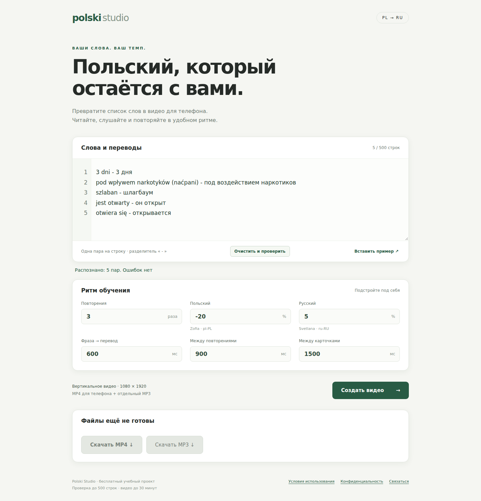
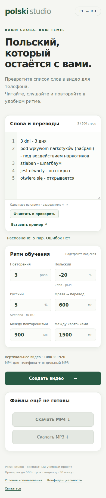

<div align="center">

# Polski Studio

### Ваши слова. Ваш темп.

**Польско-русские учебные карточки с естественной речью — в MP3 и вертикальном MP4.**

[](https://github.com/Uniqornot/polski-studio/actions/workflows/tests.yml)


[Быстрая установка](#быстрая-установка) · [Как пользоваться](#как-пользоваться) · [Настройка](#настройка) · [Хранение файлов](#хранение-файлов)

</div>



Вставьте список `PL - RU`, проверьте его и получите готовый материал для повторения: польская фраза, русский перевод, пауза — и ещё два повтора. Можно слушать MP3 отдельно или смотреть видео с крупными карточками на телефоне.

## Возможности

- Облачная речь Microsoft через `edge-tts`: отдельные голоса **Zofia** для польского и **Svetlana** для русского. Офлайн-движков нет.
- Нормализация текста, номера строк и понятные сообщения об ошибках. Кнопка создания активна только после успешной проверки.
- Настройка темпа, повторов и пауз; выравнивание громкости.
- MP4 **1080 × 1920**, H.264/AAC, 10 кадров/с; подсветка текущей фразы.
- Очередь, прогресс и отмена; уникальные имена файлов с датой и временем.
- Кэш речи и нормализованного аудио, до трёх параллельных запросов синтеза.
- Адаптивный интерфейс, доступные элементы управления и правовая информация.

## Быстрая установка

Нужен Docker с Compose; на Windows — Docker Desktop с Linux-контейнерами.

1. В [Releases](https://github.com/Uniqornot/polski-studio/releases/latest) скачайте **архив Docker-образа** и **архив установки**.
2. Распакуйте установку и положите рядом архив образа.
3. Откройте терминал в этом каталоге и выполните:

   ```bash
   docker load -i polski-studio-1.0.0-docker-linux-amd64.tar.gz
   docker compose up -d
   ```

Откройте **http://127.0.0.1:8080**. Готовый образ — **linux/amd64**; для синтеза нужен интернет, API-ключ не требуется.

[Подробная установка, права каталогов и настройки](docs/УСТАНОВКА-РЕЛИЗА.md) · [Сборка из исходников](docs/СБОРКА-ИЗ-ИСХОДНИКОВ.md)

## Как пользоваться

1. Вставьте по одной паре на строку:

   ```text
   szybkich ruchów - быстрых движений
   szlaban jest otwarty - шлагбаум открыт
   planuję ćwiczyć na rowerze stacjonarnym - я планирую заниматься на велотренажёре
   ```

2. Нажмите **«Очистить и проверить»**. Исправьте строки, отмеченные ошибками.
3. Когда кнопка **«Создать видео»** станет зелёной, запустите генерацию. Изменение текста требует повторной проверки.
4. Дождитесь завершения и скачайте **MP4** и/или **MP3**.

По умолчанию: **3 повтора**, пауза между языками **600 мс**, между повторами **900 мс**, между карточками **1500 мс**. Польский голос `pl-PL-ZofiaNeural`, скорость `−20%`; русский `ru-RU-SvetlanaNeural`, скорость `+5%`. Настройки можно менять в форме.

Имена результатов: `polski_ГГГГ-ММ-ДД_ЧЧ-ММ-СС_идентификатор.mp3` и `.mp4`. После обновления страницы прошлое задание не восстанавливается: кнопки скачивания снова неактивны. Работа на сервере при этом продолжается.

<details>
<summary><strong>Интерфейс на телефоне</strong></summary>



</details>

## Настройка

Скопируйте `.env.example` в `.env` (`cp .env.example .env` или `Copy-Item .env.example .env` в PowerShell). В текущем проекте API-ключи не используются. `.env` исключён из Git.

| Переменная | По умолчанию | Назначение |
|---|---|---|
| `TTS_BIND_ADDRESS` | `127.0.0.1` | Адрес хоста для публикации порта |
| `TTS_PORT` | `8080` | Внешний порт; внутри контейнера всегда 8080 |
| `TTS_ALLOWED_ORIGINS` | пусто | Разрешённый внешний адрес при работе через прокси |

Для доступа из домашней сети укажите **IP вашего компьютера в LAN** в `TTS_BIND_ADDRESS`. Для HTTPS через обратный прокси задайте `TTS_ALLOWED_ORIGINS=https://ваш-домен`. Несколько адресов разделяются запятой. После изменения выполните `docker compose up -d`.

**Авторизации в приложении нет.** Для публичного сервера настройте вход или ограничения на обратном прокси. Проверка Origin, лимиты ввода и очередь не заменяют авторизацию.

## Ресурсы и ограничения

Контейнер ограничен **2 CPU**, **1 ГиБ RAM** и **128 процессами**. Корневая файловая система доступна только для чтения; запись разрешена в `cache`, `output` и временный каталог до 256 МиБ. Логи ротируются. Квоты на диск у каталогов `cache`/`output` нет — свободное место нужно контролировать отдельно.

Ввод: до 500 строк, 100 000 символов, 1000 символов на фразу и 200 уникальных речевых фрагментов. Максимальная длительность материала — 30 минут. Дедлайн задания отсчитывается с постановки в очередь. Доступность облачной речи зависит от Microsoft и сети; `edge-tts` не является официальным SDK с гарантией сервиса.

## Хранение файлов

- Таймер **10 минут** начинается после первого успешного полного скачивания каждого MP3/MP4. Повторное скачивание его не продлевает. HEAD, прерванное скачивание и Range-запросы таймер не запускают.
- Через 10 минут после первого скачивания любого результата удаляются текст, настройки, отчёт и субтитры задания; его речевой MP3/WAV-кэш также очищается. Используемый активной генерацией кэш удаляется после её завершения.
- Нескачанный второй результат автоматически по этому таймеру не удаляется. Нескачанные задания и малые записи статуса остаются до явной очистки. Локальные скачанные копии не затрагиваются.

Для обслуживания сначала остановите сервис. Просмотр заданий старше 30 дней и их удаление:

```bash
docker compose stop
docker compose run --rm --no-deps studio python cleanup.py --days 30
docker compose run --rm --no-deps studio python cleanup.py --days 30 --apply
docker compose up -d
```

Добавьте `--normalized-cache-only`, чтобы обслуживать только старые нормализованные WAV с манифестами. Этот режим не удаляет речевые MP3. Автоматической очистки всех нескачанных заданий нет.

## MP3 из командной строки

Пары можно хранить отдельно в `phrases.json`:

```json
[
  {"pl": "szybkich ruchów", "ru": "быстрых движений"},
  {"pl": "szlaban", "ru": "шлагбаум"}
]
```

```bash
docker compose run --rm studio python generate.py --input phrases.json --output output/polski_slowa_3x.mp3
```

CLI создаёт аудио и отчёт, видео создаётся через веб-интерфейс. Веб-таймер после скачивания не применяется к файлам, созданным только CLI.

## Разработка и проверки

```bash
docker build --target test -t polski-studio:test .
docker run --rm polski-studio:test
```

В наборе 55 тестов: разбор текста, лимиты, отмена, кэш и блокировки, паузы, таймлайн видео, скачивание и очистка. Проверки автоматически запускаются в GitHub Actions.

| Файл | Назначение |
|---|---|
| `app.py` | Веб-сервис, очередь и скачивание |
| `parser.py` | Разбор и нормализация пар |
| `tts.py`, `control.py` | Синтез, кэш, аудио и отмена |
| `video.py` | Карточки и сборка видео |
| `generate.py`, `cleanup.py` | CLI и обслуживание |
| `static/`, `templates/` | Интерфейс |
| `compose.yaml`, `Dockerfile` | Контейнер и лимиты ресурсов |

## Лицензия и правовая информация

Отдельная открытая лицензия на исходный код пока **не назначена**. Публичность репозитория сама по себе не предоставляет лицензию на произвольное распространение и изменение кода. Условия сторонних компонентов и провайдера речи действуют отдельно.

На сайте есть условия использования и информация об обработке данных. Перед собственным развёртыванием отредактируйте `static/legal.html` и контакт в `templates/index.html`, чтобы они соответствовали вашему сервису. Не отправляйте конфиденциальные сведения: текст передаётся провайдеру облачной речи.

Автор: [Uniqornot](https://github.com/Uniqornot). Контакт: **moonstranger777@gmail.com**.
